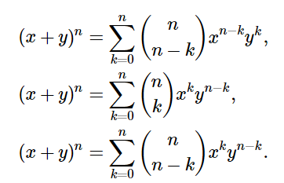

#### Set theory

- A, B are both sets such that:

    * A ∪ B = {x ∈ A or x ∈ B or both}

    * A ∩ B = {x ∈ A and x ∈ B}

    * A ⊕ B = (A - B) ∪ (B - A) = (A ∪ B) - (A ∩ B)

    * A - B = A ∩ Bᶜ = {x ∈ A and x ∉ B}

    - Demorgan's laws:

        * (A ∪ B)ᶜ = Aᶜ ∩ Bᶜ

        * (A ∩ B)ᶜ = Aᶜ ∪ Bᶜ

    - Associativity: 

        * A ∪ (B ∪ C) = (A ∪ B) ∪ C = A ∪ B ∪ C

    - Distributivity;

        * A ∪ (B ∩ C) = (A ∪ B) ∩ (A ∪ C)

        * A ∩ (B ∪ C) = (A ∩ B) ∪ (A ∩ C)

- Subsets: 

    * A ⊆ A ∪ B = B ∪ A

    * B ⊆ A ∪ B

    * If A ⊆ B, then A ∪ B = B

    * A ∩ B ⊆ A ⊆ A ∪ B

    * B ∩ A ⊆ B ⊆ A ∪ B

- Universal Set = U:

    for any finite set A

    * `U = { x ∈ U | x ∉ A }`

    * Aᶜ = U - A

    * (Aᶜ)ᶜ = A

    * Uᶜ = ∅

    * ∅ᶜ = U
 
 - Bidirectional inclusion:

    * To prove A = B, need to prove both B ⊆ A and A ⊆ B

- Power-set:

 * The power set of A is denoted as P(A) or 2A

 * A ∈ P(A), ∅ ∈ P(A)

 * `If |A| = n, then |P(A)|` = 2n

 * `|P(A)|` = 2|A|

 * If A = ∅, then P(A) = {∅}

 * If A = {1,2}, then P(A) = {∅, {1}, {2}, {1, 2}}

 * `|A| < |P(A)|`
 
 * P(A) ∩ P(B) = P(A ∩ B)

    - Proof
        * Forward Inclusion:
            Let 𝑋 be an arbitrary element in 𝑃(𝐴) ∩ 𝑃(𝐵). By definition of intersection, 𝑋 belongs to both 𝑃(𝐴) and 𝑃(𝐵). This implies 𝑋 is a subset of both 𝐴 and 𝐵. Consequently, 𝑋 is also a subset of their intersection, 𝐴 ∩ 𝐵. Thus, 𝑋 is an element of 𝑃(𝐴 ∩ 𝐵). Therefore, 𝑃(𝐴) ∩ 𝑃(𝐵) ⊆ 𝑃(𝐴 ∩ 𝐵).

        * Reverse Inclusion:
            Let 𝑌 be an arbitrary element in 𝑃(𝐴 ∩ 𝐵). By definition, 𝑌 is a subset of 𝐴 ∩ 𝐵, hence a subset of both 𝐴 and 𝐵. Consequently, 𝑌 belongs to both 𝑃(𝐴) and 𝑃(𝐵). Thus, 𝑌 is an element of 𝑃(𝐴) ∩ 𝑃(𝐵). Therefore, 𝑃(𝐴 ∩ 𝐵) ⊆ 𝑃(𝐴) ∩ 𝑃(𝐵).

        * Conclusion:
            Combining both directions of inclusion, we've demonstrated that 𝑃(𝐴) ∩ 𝑃(𝐵) ⊆ 𝑃(𝐴 ∩ 𝐵) and 𝑃(𝐴 ∩ 𝐵) ⊆ 𝑃(𝐴) ∩ 𝑃(𝐵), implying 𝑃(𝐴) ∩ 𝑃(𝐵) = 𝑃(𝐴 ∩ 𝐵). Thus, the equality holds.

    
 * P(A) ∪ P(B) ≠ P(A ∪ B)

    - Example of why these aren't equal: 
        * A = {1}, B = {2}, A ∪ B = {1,2} => P(A ∪ B) = {∅, {1}, {2}, {1,2}}

        * P(A) = {∅, {1}}, P(B) = {∅, {2}} => P(A) ∪ P(B) = {∅, {1}, {2}}

- Cartesian product:

 * `A × B = { (a, b) | a ∈ A and b ∈ B }`

    - an unordered set of sets of ordered pairs where a is in A, b is in B
    
    - if A = {1,2}, B = {2,3}, then A × B = {(1,2), (1,3), (2,2), (2,3)}

 * A × B ≠ B × A (unless A = B)

 * A ∩ (A × B) = ∅

 * `|A × B| = |A| × |B|`

 - Distribution:

    * A × (B ∪ C) = (A × B) ∪ (A × C)

    * A × (B ∩ C) = (A × B) ∩ (A × C)

#### Relations

- ARB = (a,b) ∈ R

- Identity: Ia = (a,a) 

    * Ex: {(1,1),(2,2),(3,3), ... } 

- Relation on set itself: R ⊆ A × A

    * ARA is another way to write it too. 

- Empty relation when R = ∅

    * implies that the relation R is empty, meaning it does not hold between any two pairs. It's essentially a relation with no elements.

- Complete relation when R = A × B

    * implies that the relation R contains all possible pairs that can be formed by taking one element from set A and one element from set B. It's a relation where every element of A is related to every element of B.

- Inverse relation is R⁻¹ = `{ (b, a) | (a, b) ∈ R }`

    * R consists of all pairs in R but with their elements reversed. If (a,b) is in R, then (b,a) is in R⁻¹

- Composition of relations:

    * R ∘ S = `{ (a, c) | ∃ b : (a, b) ∈ R and (b, c) ∈ S }`

    * Set of pairs (a,c) such that exists an element b for which both (a,b) is in R and (b,c) is in S

    * R ∘ R = R2 is a relation composed with itself
    
    * (R ∘ S) ∘ T = R ∘ (S ∘ T) i.e it is associative (but not communitive)

    * Ia ∘ R = R 
    
- Important relations:

    1. **Reflexive:**
    - Shorthand: Ia ⊆ R
    - Meaning: Every element is related to itself. 
        - for all a ∈ A, aRa holds
        -  \( R ⊆ \{(a, a) \| a ∈ A\} \)

    2. **Transitive:**
    - Shorthand: \( R ∘ R = R2   ⊆ R \)
    - Meaning: If \( (a, b) ∈ R \) and \( (b, c) ∈ R \), then \( (a, c) ∈ R \).
        - (aRb and bRc) -> aRc

    3. **Symmetric:**
    - Shorthand: \( R = R⁻¹ \)
    - Meaning: If \( (a, b) ∈ R \), then \( (b, a) ∈ R \).
        - When aRb <=> bRa

    4. **Antisymmetric:**
    - Shorthand: \( R ∩ R⁻¹ ⊆ \{(a, a) \| a ∈ A\} \)
    - Meaning: If \( (a, b) ∈ R \) and \( (b, a) ∈ R \), then \( a = b \).
        - (aRb and bRa) -> (a = b)
    - This does not mean not-symmetric 

- Equivalence relation

    -  is one where 1,2,3 all hold

- Order relation 
  
    - Partial order IFF 1,2,4 all hold
        * clear hasse diagram can be drawn 
            - items for which the relation doesn't hold will be drawn but not connected to the others in the diagram
    
    - Total/Linear order:
        * Partial order holds
        * Totality: For any \( a, b ∈ A \), either \( (a, b) ∈ R \) or \( (b, a) ∈ R \).
         - In other words: For any two distinct elements a and b, either a is related to b (a ≤ b), or b is related to a (b ≤ a).
        * hasse diagram would be a straight line (all elements relate to one another in this set)

    - Terms:
        * Minimal: An element a is minimal if there is no b such that b precedes a.
            -  Elements with nothing less than them (no predecessors)
        * Minimum: An element a is a minimum if for all b, a precedes b.
            -  Element that is less than everything else (either a set has 1 minimum or no minimum element)
        * Maximal: An element a is maximal if there is no b such that a precedes b.
            - follows from minimal
        * Maximum: An element a is a maximum if for all b, b precedes a.
            - follows from minimum

#### Functions

Let f,g be two functions, (f:A -> B) , (g:B -> A)

| Function f           | Onto                                                                  | One to One                                                                                           | Onto and One to One                            | Identity Ia                                                                     |
| -------------------- | --------------------------------------------------------------------- | ---------------------------------------------------------------------------------------------------- | ---------------------------------------------- | ------------------------------------------------------------------------------- |
| Horizontal line test | Hits at least 1 point                                                 | Hits at most 1 point                                                                                 | Hits exactly at 1 point                        | Hits exactly at 1 point                                                         |
| Classification        | Surjective                                                            | Injective                                                                                            | Bijective                                      | Bijective                                                                       |
| Invertibility        | Right invertible                                                      | Left Invertible                                                                                      | Invertible                                     | Invertible                                                                      |
| G is - inverse of f  | f ∘ g = Ib                                                            | g ∘ f = Ia                                                                                           | g ∘ f = Ia, f ∘ g = Ib                         | f ∘ Ia = f = Ib ∘ f                                                             |
| Definition           | {f(a) | a ∈ A} = B every element in range (B) has a source            | if a1 != a2 then f(a1) != f(a2) or contrapositive if f(a1) = f(a2) then a1 = a2                      | f⁻¹ = g                                        | f(a) = a                                                                        |
| English              | function that maps one or more elements of A to the same element of B | function that always maps the distinct element of its domain to the distinct element of its codomain | function that is both injective and surjective | function that always returns the value that was used as its argument, unchanged |

- Notation for function composition 

    * (g ∘ f)(a) = g(f(a))
        - g composed with f

#### Cardinality

| Aleph-0 | Countably infinite   | ℕ                   | ℕ x ℕ                         | ℕ x ℕ x ℕ | ℤ | ℚ     | ℚ x ℚ |
| ------- | -------------------- | ------------------- | ----------------------------- | --------- | - | ----- | ----- |
| Aleph   | Uncountably infinite | (0,1)               | {0,1}^ℕ                       | P(ℕ)      | ℝ | ℝ x ℝ | ℂ     |
|         |                      | or any interval     | Cantor's diagonalization arg. |           |   |       |       |
| Finite  | Countably finite     | if A = {1}, `|A|` = 1 |                               |           |   |       |

#### Combinatorics

n = Boxes, k = Balls

- Order matters
    * sequence of choices 

- Order doesn't matter
    * if we picked ball 1 then ball 2... it would be equivalent to picking ball 2 then ball 1

- With replacement
    * same item can be picked several times

- Without replacement
    * each item is chosen at most, 1 time 

- Cases:
    * Case 1: nk
        - K times out of n objects 
        - Number of functions from A to B
            - `|A| = K, |B| = n`
            - if A has 3 elements, and B has 5... we would get 5^3 total functions that can be defined 

    * Case 2: nPk
        - K unique balls in n small boxes (can only fit 1 item in each box)
        - number of one to one functions from A to B 
    
    * Case 3: nCk
        - K identical balls in n small boxes 
        - Binomial coefficients

    * Case 4: (k+n-1)C(k)
        - Bars and stars 
        - K identical balls in n numbered boxes (but each box can hold >= 0 balls)

 - Binomial expansion
    * 

##### Links

* [Unions and Intersections](https://proofwiki.org/wiki/Union_Distributes_over_Intersection)

* [Union in Set Theory](https://en.wikipedia.org/wiki/Union_(set_theory))

* [Discrete Math](https://www.tutorialspoint.com/discrete_mathematics/discrete_mathematics_sets.htm)

* [Logic and Sets](https://www.whitman.edu/mathematics/higher_math_online/section01.05.html)

* [Defining relations on sets](https://math.libretexts.org/Courses/Monroe_Community_College/MTH_220_Discrete_Math/6%3A_Relations/6.1%3A_Relations_on_Sets)

##### Programs/Calculators

* [My multinomial calculator (WIP)](https://avi.is-a.dev/web_calculator/discrete/multi.html)

* [Binomial expansion calculator](https://www.analyzemath.com/Calculators/binomial_theorem_expansion_calculator.html)

* [Combinatorics calculator](https://home.ubalt.edu/ntsbarsh/business-stat/otherapplets/comcount.htm)

* [Logic calculator - quite good](https://sheabunge.github.io/boolcalc/)

* [Power Set Calculator](https://www.wolframalpha.com/input?i=power+set+%7B%7B1%2C2%7D%2C%7B3%2C4%7D%2C+%285%2C6%29%7D)

* [SymPy - python library for logic](https://www.sympy.org/en/index.html)
