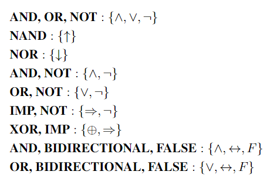
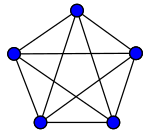
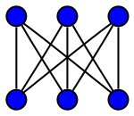

Some digital systems content, sentential logic, predicate logic, graph theory 

Read: Discrete Mathematics and Its Applications by Kenneth H. Rosen (not required by the course)

* [Syllabus](/static/post-image/logic_syllabus.pdf)

* [Formula Sheet](/static/post-image/logic_formula_sheet.pdf)

* [YouTube Playlist](https://www.youtube.com/playlist?list=PL9DdgseuDZgKbu9DeqWJTbETQ8ZOIR2wO)

### Notes: 

- We studied sentential logic as part of the course, but it is often referred to as Propositional logic/calculus

- We also used a system called L arrow which exists in sentential logic (sometimes called language PC) 

- I advise reading the Rosen Discrete Math Book, in the first few hundred pages... it covers most of what the course does.

- Functionally complete sets that are good to know for exams and homeworks, here is a non exhaustive list of some basic ones

##### Graphs: 

| Word                        | Definition                                                                                                                                                                                                                                                                                                           | Notation                    |
| --------------------------- | ------------------------------------------------------------------------------------------------------------------------------------------------------------------------------------------------------------------------------------------------------------------------------------------------------------------- | --------------------------- |
| Graph                       | Set of vertices and set of edges                                                                                                                                                                                                                                                                                    | G=(V,E)                     |
| Vertex                      | Unique node                                                                                                                                                                                                                                                                                                         | v ∈ V                       |
| Edge                        | Pair of 2 vertices (linked)                                                                                                                                                                                                                                                                                         | e ∈ E                       |
| Adjacent vertices/Neighbors | f there is an edge from one vertex to the other ie v-u or v<->u, so v and u are adjacent to each other ... but v->u v is adjacent to u but u isn't adjacent to v                                                                                                                                                    |                             |
| Degree                      | Number of edges touching that vertex (in undirected graph)                                                                                                                                                                                                                                                          | d(v)                        |
| in-degree                   | number of edges coming into vertex vx... ie v3->vx->v2 , vx has in-degree of 1 (from v3 coming in) (directed graph)                                                                                                                                                                                                 | Din(v)                      |
| out-degree                  | number of edges leaving vertex vx (directed graph)                                                                                                                                                                                                                                                                  | Dout(v)                     |
| Connected vertices          | In an undirected graph, an unordered pair of vertices {x, y} is called connected if a path leads from x to y. Otherwise, the unordered pair is called disconnected. (path exists between them)                                                                                                                      |                             |
| Path                        | sequence of vertices connected by edges.                                                                                                                                                                                                                                                                            | {v1,....,v4}                |
| Cycle                       | A cycle is a path that starts and ends at the same vertex.                                                                                                                                                                                                                                                          | {v1,v2,...v1........vn, v1} |
| Simple path                 | path that doesn't repeat any vertices                                                                                                                                                                                                                                                                               |                             |
| Simple Cycle                | A simple cycle is a cycle that repeats no vertices except that the first vertex is also the last (in undirected graphs, no edge can be repeated)                                                                                                                                                                    |                             |
| Euler path                  | Path that uses every edge of graph exactly once                                                                                                                                                                                                                                                                     |                             |
| Euler cycle                 | a cycle that uses each edge exactly once (undirected graph)                                                                                                                                                                                                                                                         |                             |
| Hamilton path               | path that visits each vertex exactly once - tracable                                                                                                                                                                                                                                                                |                             |
| Hamilton cycle              | cycle that visits each vertex exactly once                                                                                                                                                                                                                                                                          |                             |
| Depth                       | \# of edges in path from root to that node                                                                                                                                                                                                                                                                          |                             |
| Distance                    | length of shortest path having vertices v,u at the endpoints                                                                                                                                                                                                                                                        |                             |
| Diamater                    | in connected graph it is maximum length of shortest path - max of distances between pairs of vertices in graph                                                                                                                                                                                                      |                             |
| Path length                 | \# of edges in a path                                                                                                                                                                                                                                                                                               |                             |
| Component                   | subset ov vertices Vi ⊆ V                                                                                                                                                                                                                                                                                           |                             |
| Connected component         | subset ov vertices Vi ⊆ V tat is connected                                                                                                                                                                                                                                                                          |                             |
|                             |                                                                                                                                                                                                                                                                                                                     |                             |
| Graph Atttrbutes            |                                                                                                                                                                                                                                                                                                                     |                             |
| Undirected Graph            | {v1,v2} = {v2,v1} ... if v1 shares an edge with v2 (we draw a line for the edge)                                                                                                                                                                                                                                 |                             |
| Directed Graph              | (v1,v2) means v1 -> v2 ... but we cannot go from v2 -> v1 unless another edge exists (v2,v1)                                                                                                                                                                                                                        |                             |
| Subgraph                    | A subgraph of a graph G is a graph whose vertices and edges are subsets of the vertices and edges of G, respectively                                                                                                                                                                                                | H ⊆ G                       |
| Induced Subgraph            | An induced subgraph of a graph G is a subset of vertices V' and all edges whose endpoints are both in V'                                                                                                                                                                                                            | G[V'].                      |
| Simple                      | a graph that does not contain more than one edge between the pair of vertice                                                                                                                                                                                                                                        |                             |
| Complete                    | each pair of vertices is joined by an edge. A complete graph contains all possible edges.                                                                                                                                                                                                                           |                             |
| Regular                     | each vvertex has same degree                                                                                                                                                                                                                                                                                        |                             |
| K-regular                   | regular graph where each vertex has degree K                                                                                                                                                                                                                                                                        |                             |
| Bipartite                   | a graph where the vertices can be divided into two disjoint sets such that all edges connect a vertex in one set to a vertex in another set. There are no edges between vertices in the disjoint sets.                                                                                                              |                             |
| Planar                      | A planar graph is a graph that can be drawn in the plane without any edges crossing.                                                                                                                                                                                                                                |                             |
| Complete bipartite          | a special bipartite graph where every vertex on one side of the bipartition is connected to every vertex on the other side                                                                                                                                                                                          |                             |
| Clique                      | a subset of vertices of an undirected graph such that every two distinct vertices in the clique are adjacent. an induced subgraph of G that is complete.                                                                                                                                                            |                             |
| Peterson graph              | nonplanar, hamiltonian path, no hamiltonian cycle                                                                                                                                                                                                                                                                   |                             |
| Connected                   | if, for each pair of vertices, there exists at least one single path which joins them                                                                                                                                                                                                                               |                             |
| Acyclic                     | a graph with no cycles                                                                                                                                                                                                                                                                                              |                             |
| Hamiltonian-connected       | if for every pair of vertices there is a Hamiltonian path between the two vertices.                                                                                                                                                                                                                                 |                             |
| DAG                         | Directed graph wihtout any directed cycles                                                                                                                                                                                                                                                                          |                             |
| Tree                        | Connected and acyclic or add edge = makes a cycle, or remove edge disconnects graph                                                                                                                                                                                                                                 |                             |
| Kn                          | Complete graph on n vertices                                                                                                                                                                                                                                                                                        |                             |
| Cycle graph                 | a graph that consists of a single cycle, or in other words, some number of vertices (at least 3, if the graph is simple) connected in a closed chain.                                                                                                                                                               |                             |
| Cn                         | Cycle graph on n vertices (|n| = # ov vertices = # edges in this case)                                                                                                                                                                                                                                              |                             |
| Ka,b                        | is a bipartite graph that consists of two disjoint sets of n vertices each, with every vertex in the first set connected to every vertex in the second set. In other words, if we have two sets of vertices U and V, each with n vertices, then a,b has an edge between every pair of vertices u ∈ U and v ∈ V. |                             |
| Gc                         | a graph G' (complement) on the same set of vertices as of G such that there will be an edge between two vertices (v, e) in G', if and only if there is no edge in between (v, e) in G                                                                                                                               | G'(v, e')                   |
| GT                         | a graph GT (transpose) where V is the same set of vertices as in G, but ET  is the set of edges E but with directions reversed (directed graph), if e = (v,u), eT = (u,v)                                                                                                                                         | GT  = (V, ET )              |

###### More graph properties:

- In the course, we usually substitute F = number of faces,  n = number of vertices, m = number of edges (important for formula sheet)

- Graph is bipartite iff it only has cycles of even length 

- K5 - Graph with 5 vertices all realized (complete)

- K3,3 - Graph that has 3 vertices on left, 3 on right that is bipartite and complete 

- Any complete graph (a graph in which each vertex is connected to every other vertex) with > 5 vertices is not planar: homeomorph of K5 or K3,3

- Any complete graph has a Hamilton cycle 

- Graph with m >= n-1 edges, n >= 3 vertices will have a cycle

- Regular graph = each vertex has the same degree (same number of edges touching it)

- A Hamiltonian path that starts and ends at adjacent vertices can be completed by adding one more edge to form a Hamiltonian cycle, and removing any edge from a Hamiltonian cycle produces a Hamiltonian path.

- Qn - graph of n-dimensional hypercube 

  * is bipartite

  * Always has 2n vertices, n2n-1 edges

    - it is a regular graph, each vertex has degree of n

  * for even n, it will have a Euler cycle 

  * for graph with n > 1
  
    - has Hamiltonian cycle 
 
    - is planar (iff 1 < n <= 3)
  
  * Q3 is a cube, higher dimensions are harder to visualize

#### Good to know 

Implication: A ⇒ B

  * A implies B (If A then B)

    - A ⇒ B is false when A is true and B is false, but otherwise it's true

Meta-Deduction: A ⊢ B

  * A proves B

    - B can be proved using A as premise

  * ⊢ A

    - A is a tautology (every premise can deduce A)

Meta-implication: A ⊨ B

  * A entails B

    - B is true in every structure where A is true

    - In every model, it is not the case that A is true and B is false

###### Terms you may see elsewhere

First order logic = Predicate logic (For all, There exists)

* If A ⊢ B then A ⊨ B (soundness theorem)

* If A ⊨ B then A ⊢ B (completeness theorem)

Propositional logic = sentential logic (L arrow and L2)

Cycle = Circuit = Tour

Path = Trail 

Edge = Arc

### Useful Links

* [Propositional Logic](https://iep.utm.edu/prop-log/)

* [A Brief Overview of Logic](http://www.math.hawaii.edu/~ramsey/Logic.html)

* [Math Logic Course - Stonybrook](https://www3.cs.stonybrook.edu/~cse541/)

* [Hebrew Discrete Math Book](https://www.cs.mta.ac.il/staff/Michal_Parnas/publications.html)

<!-- * [Discrete Math Course - Tel Aviv U](http://courses.cs.tau.ac.il/bdida/06b/bdida06b.html) -->

* [Truth Tables, Tautologies, and Logical Equivalences](https://sites.millersville.edu/bikenaga/math-proof/truth-tables/truth-tables.html)

* [Explaining Quantifiers](https://www.whitman.edu/mathematics/higher_math_online/section01.02.html)

* [Deductions](https://www.cs.cornell.edu/courses/cs3110/2012sp/lectures/lec15-logic-contd/lec15.html)

### Calculators and tools

* [Truth Table Generator](https://web.stanford.edu/class/cs103/tools/truth-table-tool/)

* [Logic Calculator: Truth Tables](https://www.erpelstolz.at/gateway/TruthTable.html)

* [Another logic calculator - quite good](https://sheabunge.github.io/boolcalc/)

* [Tree Proof Generator](https://www.umsu.de/trees/)

* [SymPy - python library for logic](https://www.sympy.org/en/index.html)

Python and programming aren't required for the course but its a good way to check your work!
and view my sample program for testing logic * [here](/math/logic/program.py)
using the SymPy library